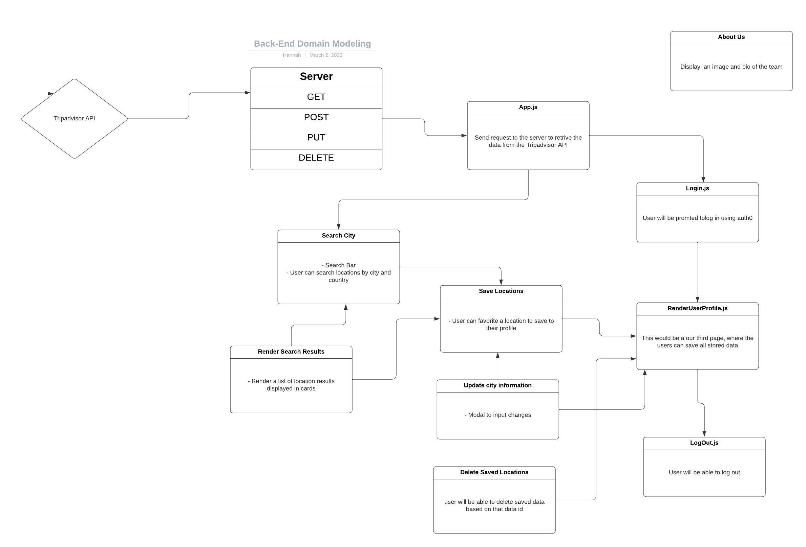

# 301 final

**Author**: Brenden Moore, Hannah Hwang, Yuri Hlukhyi, Danner Taylor

**Version**: 1.0.0

## Overview

This is where a description of our final will go.

## Getting Started

Use `npm install` to add the package.json dependencies

## Architecture

This is a beckend server for the Can of Books app that utilizes the Mongoose ODM library for MongoDB to allow a user on the frontend to perform CRUD operations on their favorite books and the status of their reading journey.

### Technologies

- Node.js
- Express.js
- Axios
- dotenv
- CORS
- MongoDB
- Mongoose

## Change Log

## Estimates

## Credit and Collaborations

### Collaborators

- Brenden Moore
- Danner Taylor
- Hannah Hwang
- Yuri Hlukhyi

### Team Agreement

#### Logistical

- What hours will you be available to communicate?

  - Brenden: Slack messages: anytime,
  - Online: anytime unless specified, works friday and sunday.

  - Danner: Slack messages: sporadic availability (work 8:30am - 7pm EST), weekends 11am - 3pm EST, 9pm - 1am EST
  - Online: 8pm - 12pm EST

  - Hannah: Slack messages: anytime,
  - Online: Tue/Th after 12pm PST, M/W/F 6:30pm - 12am PST

  - Yuri: Slack messages: anytime,
  - Online: class hours

- What platform will you use to communicate (ie. Slack, phone …)?
  - Slack, remo
- How often will you take breaks?
  - As often as we need (police yourself)
- What is your plan if you start to fall behind?
  - Bring it up in the daily standup, ask for help (as individuals). As a group, elevate and ask a TA or Roger for advice (if we can't figure out solutions - 15 minute rule).

#### Cooperative

- Knowing that every person in your team needs to understand the code, how do you plan to approach the day-to-day development?
  - Team stand up at the beginning of every class
    - What everyone is working on
    - Expected completion
    - Help needed/blockers
  - Break off into different tables to perform daily work depending on pair programming/individual assignments
  - Retrospective to make sure each person is on the same page about features/knowledge of code base
  - Mob coding, using the driver and navigator method.

#### Conflict Resolution

Explain to your team why it’s important to have a plan in place for resolving conflicts during the project.

- Discuss the types of conflicts that might arise during the project, such as differences in opinions or scheduling conflicts.

Agree on a communication protocol to use when conflicts arise, such as having a designated person to initiate the conversation.

- Establish a clear process for resolving conflicts. This could involve starting with a one-on-one conversation between the parties involved, then escalating to a group discussion if needed.

Set ground rules for conflict resolution, such as avoiding blame and focusing on the issue at hand.

- Determine a timeline for resolving conflicts and ensure everyone knows the timeline.

Assign specific roles and responsibilities to team members for resolving conflicts.

- Regularly review and adjust the plan based on feedback from the team or changes in the project scope.

### Work plan

How you will identify tasks, assign tasks, know when they are complete, and manage work in general?

- We will start off with a stand up at the start of every class and assign work to each member, depending on the work load we can split off into multiple groups.

What project management tool will be used?

- Trello project manager

### Git process

What components of your project will live on GitHub?

- Our frontend and backend.

How will you share the repository with your teammates?

- through a girhub organization.

What is your Git flow?

- Our flow will consists of every member having their own named branch merging to a dev branch, followed by merging to main at the end of the day.

Will you be using a PR review workflow? If so, consider:

- Yes, 1 member will review a piece of code in order to merge to the dev branch, followed by everyone being present for a merge to main.

How many people must review a PR?

- At least 1 person.

Who merges PRs?

- Anyone can merge as long as they didnt write the code, and have seen the code working or reviewed the code being merged.

How often will you merge?

- At the end of the day or whenever we have accomplished a mile stone.

How will you communicate that it’s time to merge?

- Through a group decision.

### User stories

1. AS A user I WANT to be able to search for a city name I am interested in visiting/have on my travel bucket list, and see details regarding that city SO THAT I can decide if what the city have to offer is what I like.

Feature Tasks:
·      Create a search form that will take in the city name after selecting ‘explore’ button
·      Connect and API that will respond with data of the city searched for in the search form
2.    AS A user I WANT to know information and different attractions offered at the search city SO THAT I would know what I can do at the city and look forward to seeing
Feature Tasks:
Have images of different attractions for the searched city rendered on the page after the user click the explore button
Have a brief description of the city searched rendered after the explore button is clicked
AS A user I WANT to be able to save a city SO THAT I can go back a see which cities I am interested in visiting.

Feature Tasks:
Create a profile page for the user to be able to store all of the saved city
Create a save/add button at the bottom so that the user can add the city to their profile

4. AS A user I WANT to be able to update and delete my saved cities SO THAT I can keep my profile updated with my current interest
Feature tasks:
Create a UPDATE functionality that will take in a …..
Create a DELETE functionality that will delete the added city from the user profile with the press of a button.
5. AS A user I WANT to be able to see the total number of cities I have saved, the total number of those saved cities I have visited and remaining to visit SO THAT I can make my future traveling plans according to that information.
Feature tasks:
Create a function that will count the total number of cities that were added to the user profile and render it in the total number of city section in the user profile.
Add a checkbox on each city card to check if a city was visited.
Create a visited functionality that will count the number of cities that receive the ‘visited’ checkbox and render it in the total number of cities visited section in the user profile.
Create a function to count the number of cities remaining to visit that subtract the number of cities visited from the total number of cities added to the profile and return the sum rendered in the ‘number of cities remaining to visit section’ of the user profile.
6. AS A user I WANT know of places to stay around the searched city SO THAT I can plan out where would be the best place to stay.

Tasks:
Create a function that retrieve the data from the API to render hotel or places to stay based on the name of the city searched.
Have the date rendered on the page in a section that is digestible for the user to view.

AS A user I WANT know where I can go to eat at the searched city (STRETCH GOAL)
Tasks:
Find an API that provide data on popular restaurants in an area based on the city name searched.
Have these restaurants rendered on the page in a digestible way for the user to view.
AS A user I WANT know what is the average ticket price of the city I searched SO THAT I can better plan my future trip (STRETCH GOAL)

Tasks:
Create a functionality that prompt the user to enter their home location to be stored in the profile and use as beginning point to travel from.
Connect with an API that find out the average ticket price to travel to the search city name, from the user home location.
Have the price of the top ticket prices rendered on the page

9. AS A user I WANT to be able to write down notes for the specific city I saved on my travel list profile SO THAT I can keep notes of anything to remember for my trip to that city. (STRETCH GOAL)
Feature Tasks:
o  Add a form where the user can write notes and have it be saved on their profile.

### Trello board wireframe

### Domain Model

